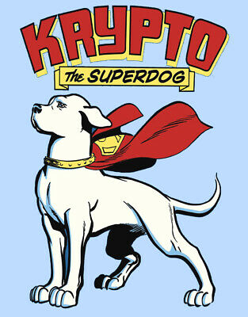
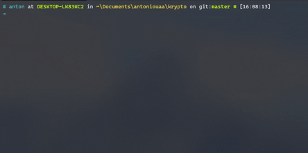
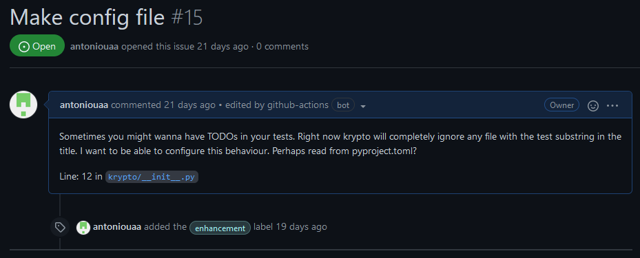

<!--  -->
<!--  -->

<div align="center">
    
    <h2 style="font-size: 48px">Krypto</h2>


[](https://github.com/psf/black)
[](https://coveralls.io/github/antoniouaa/krypto?branch=master)

<h2 style="font-size: 22px;">A neat little sidekick python script to create issues on your repo based on comments left in the code on your behalf</h2>

</div>

<div align="center">
    
</div>
Convert todo comments in your code

```py
# TODO[Enhancement]: Make config file
# Sometimes you might wanna have TODOs in your tests.
# Right now krypto will completely ignore any file with the
# substring "test" in the path. I would want to be able to
# configure this behaviour. Perhaps read from pyproject.toml?`
```

to GitHub issues on the repository you're working on!



---

## Env Variables

For this to work you need to have a github token in your environment variables.
To acquire a token navigate to [Developer Settings](https://github.com/settings/tokens) and generate one.

With the token in hand, simply,

```sh
export TOKEN_GITHUB = token_here
```

or

```ps
$env:TOKEN_GITHUB = token_here
```

If you want the token to persist across sessions you need to add it to your `.bashrc` or `$PROFILE`.

## Usage

---

### Write a TODO

First, create a TODO in the form of a block comment.
The TODO must contain a title. Body and labels are optional.

Examples:

- Title only, no body or labels

  ```py
  # TODO: This is a title
  ```

- Title, body, no labels

  ```py
  # TODO: This is a title
  # This is in the TODO body
  ```

- Title, body and labels

  ```py
  # TODO[Enhancement]: This is a title
  # This is in the TODO body
  ```

- Multiple labels
  ```py
  # TODO[Enhancement, Bug, Documentation]: This is a title
  ```

Valid separators include `,` `/` `#` `~` `\`

### To run

Pass the directory to look in for TODOs.

```sh
krypto run <path-to-dir>
```

To perform the collection and parsing of TODOs but not the HTTP request to github, pass the `--dry` flag to the run command.

```sh
krypto run <path-to-dir> --dry
```

Krypto does not look in tests/ at the moment.

---

## GitHub Action

This action runs Krypto on your code and creates issues on the repo on your behalf.

### Inputs

### `dir`

**Required** The path to the directory to scan for TODOs.

### Env

### `TOKEN_GITHUB`

**Required** A personal access token for github to use to authenticate the creation of issues on your repository.

### Example usage

```yaml
uses: antoniouaa/krypto@v2
with:
  dir: "."
env:
  TOKEN_GITHUB: ${{ secrets.GITHUB_TOKEN }}
```

_Run krypto on the root of the project_

---

Inspired by [tsoding/snitch](https://github.com/tsoding/snitch)
